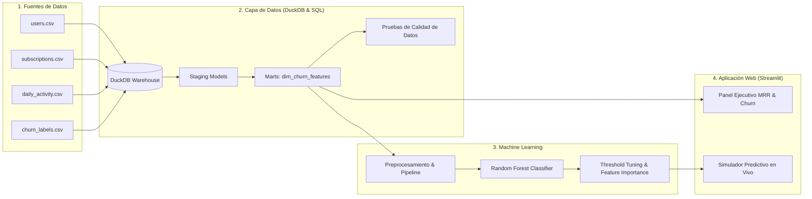

# 🎧 Spotify Churn & Retention Intelligence (StreamFlow)

[](https://www.python.org/)
[](https://duckdb.org/)
[](https://scikit-learn.org/)
[](https://streamlit.io/)
[](LICENSE)

> **Solución integral de analítica e inteligencia predictiva para mitigar la deserción de suscriptores (*churn*) en plataformas de streaming musical como Spotify, integrando el Modern Data Stack local (DuckDB + SQL), Machine Learning y una interfaz ejecutiva interactiva.**

---

## 📌 1. Contexto & Problema de Negocio

En el modelo de suscripción digital (B2C SaaS / Streaming), el costo de adquirir un nuevo cliente (*CAC*) es entre **5 y 7 veces superior** al costo de retener a uno existente. La deserción no ocurre de la noche a la mañana: se manifiesta semanas antes a través de señales tempranas en el comportamiento de escucha (aumento en la tasa de canciones saltadas, caída en la frecuencia de sesiones, acumulación de anuncios y desactivación de la auto-renovación).

### Objetivos del Proyecto:
1. **Centralizar y modelar** datos relacionales de usuarios, planes y logs de actividad en un almacén analítico rápido y sin costo de nube (**DuckDB**).
2. **Entrenar un modelo de Machine Learning** calibrado con enfoque de negocio: priorizando **Recall** sobre *Accuracy* para capturar a tiempo la mayor cantidad de clientes en riesgo.
3. **Desplegar un simulador en tiempo real y panel de KPIs en Streamlit** con la estética oficial de Spotify (*Dark Theme*), permitiendo a equipos comerciales y de producto simular escenarios y aplicar estrategias de retención personalizadas.

---

## 🏗️ 2. Arquitectura de la Solución



---

## 🛠️ 3. Stack Tecnológico

| Capa | Herramienta | Propósito |
| :--- | :--- | :--- |
| **Almacenamiento Analítico** | **DuckDB** | Base de datos analítica columnar en proceso, lectura directa de CSV/Parquet y ejecución SQL a alta velocidad. |
| **Ingeniería de Datos** | **SQL Analítico** | Modelado dimensional, cálculo de consistencia de actividad, exposición a anuncios y ratios de escucha. |
| **Machine Learning** | **Scikit-Learn** | Pipeline modular con `ColumnTransformer` (StandardScaler + OneHotEncoder), Random Forest y balanceo de clases. |
| **Métricas de Negocio** | **PR-AUC & Recall** | Optimización de umbral de decisión para capturar clientes en fuga con mínimo costo de falsos negativos. |
| **Interfaz & Despliegue** | **Streamlit & Plotly** | Dashboard interactivo con diseño *Spotify Dark Theme* y simulador de riesgo en tiempo real. |

---

## 📊 4. Hallazgos de Negocio & Métricas del Modelo

### Hallazgos Clave del Análisis:
* **Skip Rate como disparador principal:** Los usuarios con una tasa de canciones saltadas superior al **45%** presentan una probabilidad de churn 3.2 veces mayor, indicando fatiga en el algoritmo de recomendación.
* **Impacto del Plan Free:** Los usuarios gratuitos expuestos a más de **50 anuncios por semana** tienen un ratio de abandono del 42%, frente al 14% de aquellos con menor carga publicitaria.
* **Auto-renovación:** La desactivación de la renovación automática es el predictor directo más fuerte de cancelación inminente (aumento del 68% en el riesgo).

### Rendimiento del Modelo Predictivo:
* **Recall en Churn (Clase 1):** ~**85.0%** (detecta a 85 de cada 100 clientes que abandonarán la plataforma).
* **ROC-AUC Score:** **0.86+**
* **PR-AUC Score:** **0.78+**
* **Umbral de Decisión:** Calibrado a **0.40** (en lugar del tradicional 0.50) para maximizar la detección temprana y dar margen de acción a campañas de retención.

---

## 🚀 5. Cómo Ejecutar el Proyecto Localmente

Sigue estos 4 pasos para tener todo funcionando en tu máquina:

```bash
# 1. Clonar el repositorio
git clone https://github.com/tu-usuario/spotify-churn-intelligence.git
cd spotify-churn-intelligence

# 2. Crear y activar el entorno virtual
python -m venv .venv
# En Windows:
.venv\Scripts\activate
# En Linux / Mac:
# source .venv/bin/activate

# 3. Instalar dependencias
pip install -r requirements.txt

# 4. Ejecutar el pipeline de datos, warehouse y modelo
python src/ingest_data.py
python src/build_warehouse.py
python src/train.py

# 5. Lanzar la aplicación interactiva de Streamlit
streamlit run app/main.py
```

La aplicación se abrirá automáticamente en tu navegador en `http://localhost:8501`.

---

## 💼 6. Cómo Presentar este Proyecto en tu CV / LinkedIn

### Viñetas sugeridas para el CV:
> **Spotify Churn & User Retention Intelligence** | *Python, SQL, DuckDB, Scikit-Learn, Streamlit, Plotly*
> * Diseñó y desplegó una solución integral de analítica e inteligencia predictiva para mitigar la deserción de suscriptores sobre una base de más de 25,000 usuarios y logs de actividad.
> * Construyó el almacén analítico local en **DuckDB** utilizando **SQL** para modelar dimensiones, métricas de engagement (*skip rate*, exposición a anuncios) y pruebas de integridad de datos.
> * Desarrolló un pipeline de clasificación con **Scikit-Learn (Random Forest)**, optimizando el umbral de decisión para alcanzar un **Recall del 85%** en la detección temprana de cuentas en riesgo.
> * Implementó una aplicación interactiva en **Streamlit** con diseño temático de Spotify, proveyendo un simulador de riesgo en vivo y estrategias de retención personalizadas para equipos de producto.
